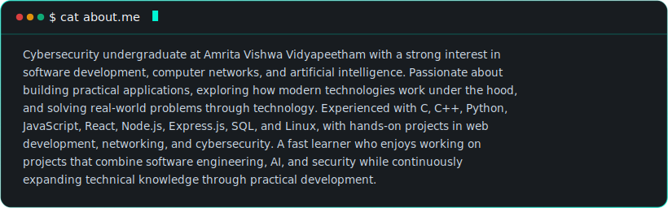
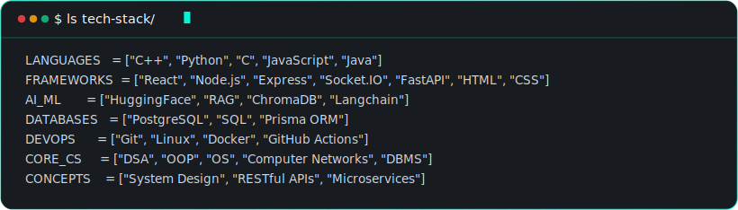
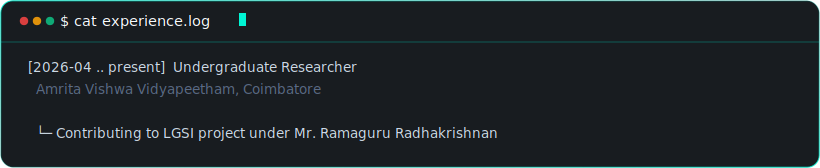
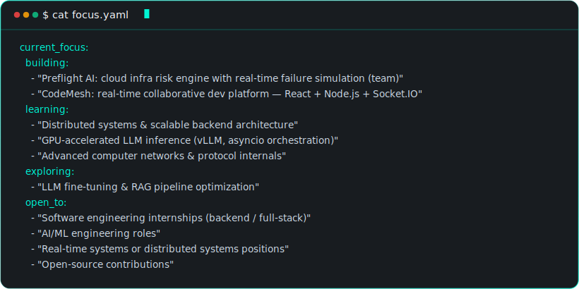

  <picture>
    <source media="(prefers-color-scheme: dark)" srcset="./dark.svg">
    <source media="(prefers-color-scheme: light)" srcset="./light.svg">
    
  </picture>

---

  

---

  

  

---

  

---

  
  &nbsp;
  

  

---

  

---

  

---

  

  
  &nbsp;
  

  
  &nbsp;
  

---

  

---

  

---

  
  &nbsp;
  
  &nbsp;
  
  &nbsp;
  

  <i>"I don't specialize in one thing — I build until I understand it."</i>

  

